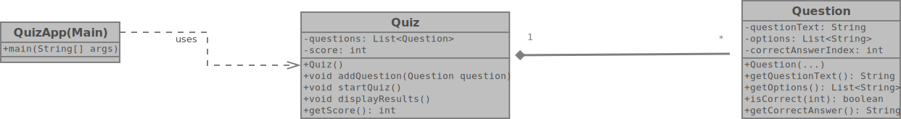

# QuizApp

---

## Project Overview
This is a command-line interface (CLI) Quiz developed in Java. Its primary purpose is to ask the user **multiple-choice questions** and **evaluate their answers** to determine a final score. This project serves as a practical application of fundamental Java concepts, including object-oriented programming (OOP) principles like **encapsulation**, **classes**, and **methods**.

---

## Functions (Features)
* **Question Management:** The application can store and manage a predefined set of multiple-choice questions, each with its question text, answer options, and the correct solution.
* **Interactive Quiz Flow:** Users are presented with questions one by one and can input their chosen answer via the console.
* **Answer Evaluation:** The quiz checks the user's input against the correct answer for each question.
* **Score Tracking:** A score is maintained throughout the quiz, incrementing for each correct answer.
* **Result Display:** Upon completion, the application displays the user's total score.

---

## UML Class Diagram
The following Unified Modeling Language (UML) Class Diagram illustrates the structure and relationships of the core classes within the QuizApp. It highlights the design principles applied, such as the separation of concerns between `Question` objects and the main `Quiz` logic.

---

## Contributing
This project is currently a personal learning endeavor. However, constructive feedback and suggestions for future enhancements are always welcome. Feel free to open an issue if you have ideas or spot any areas for improvement.

---

## Author
Dennis Garscha
